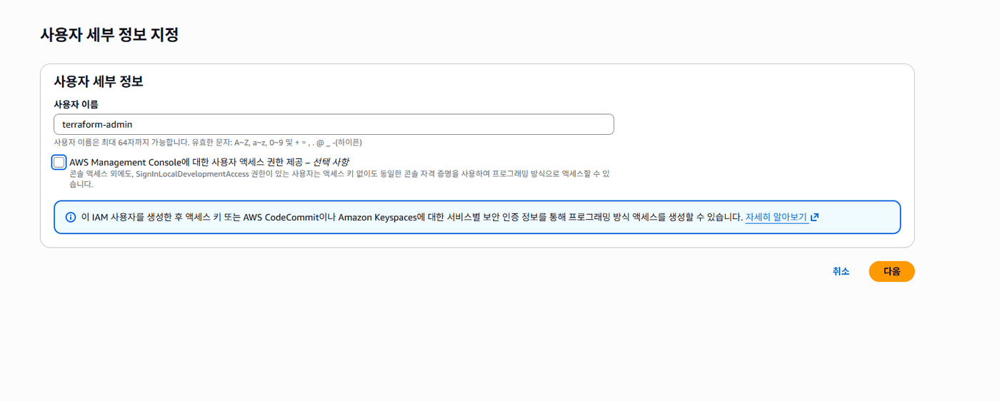
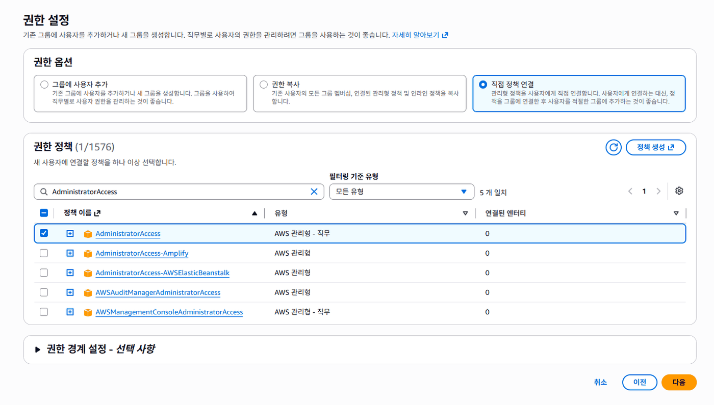
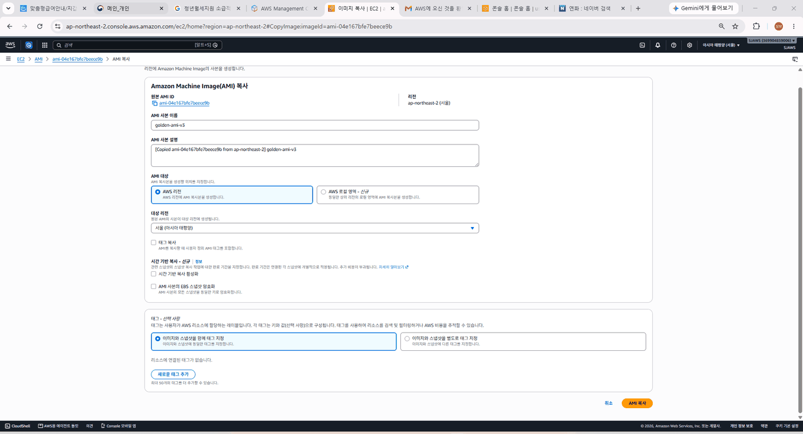
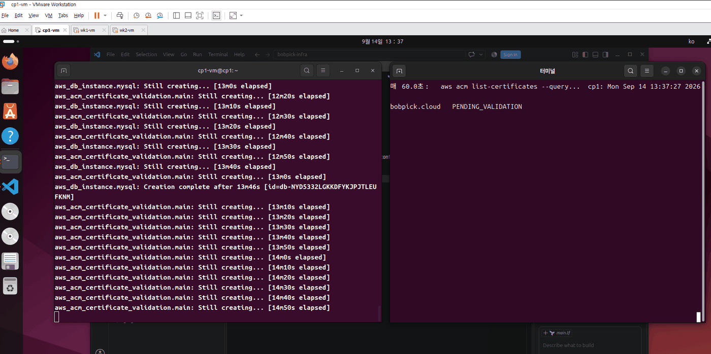
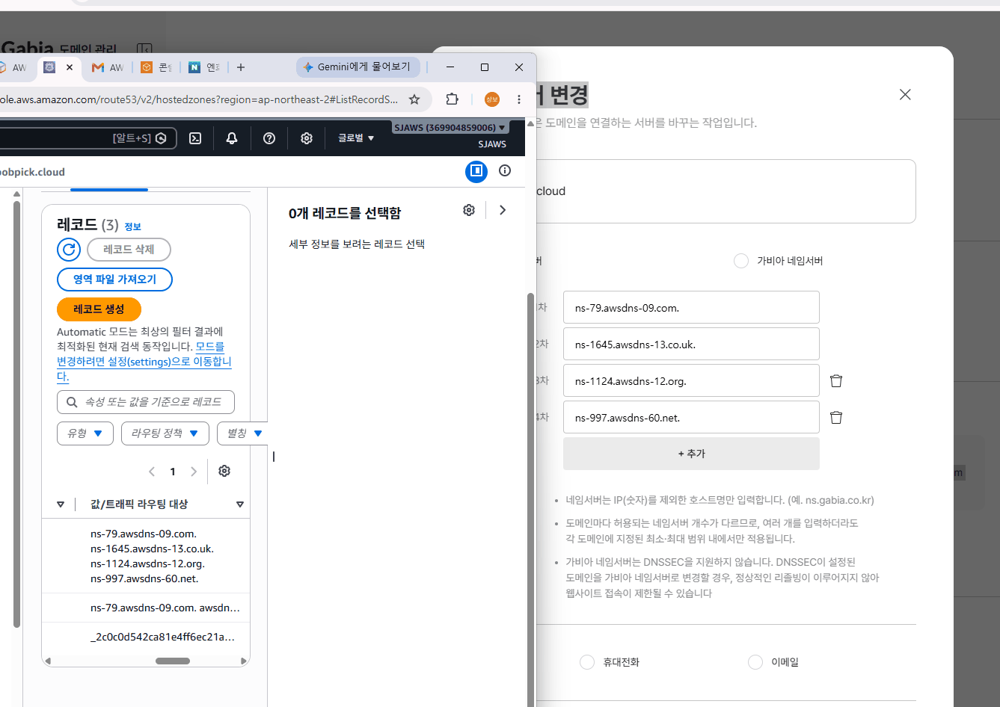
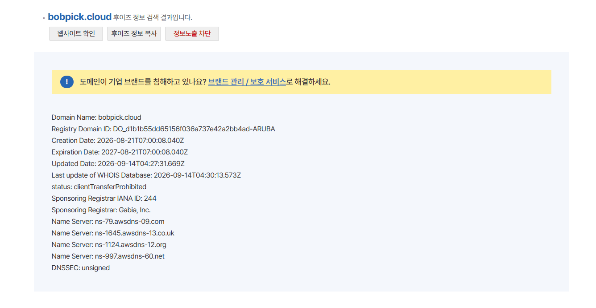
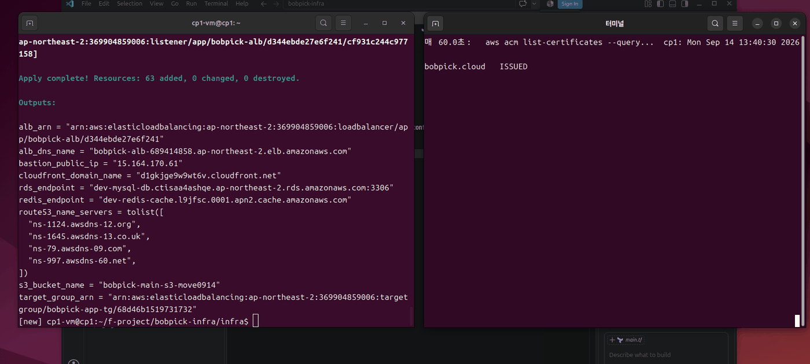
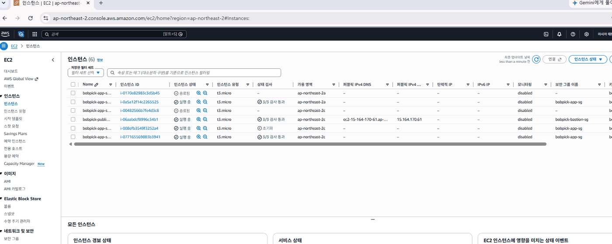
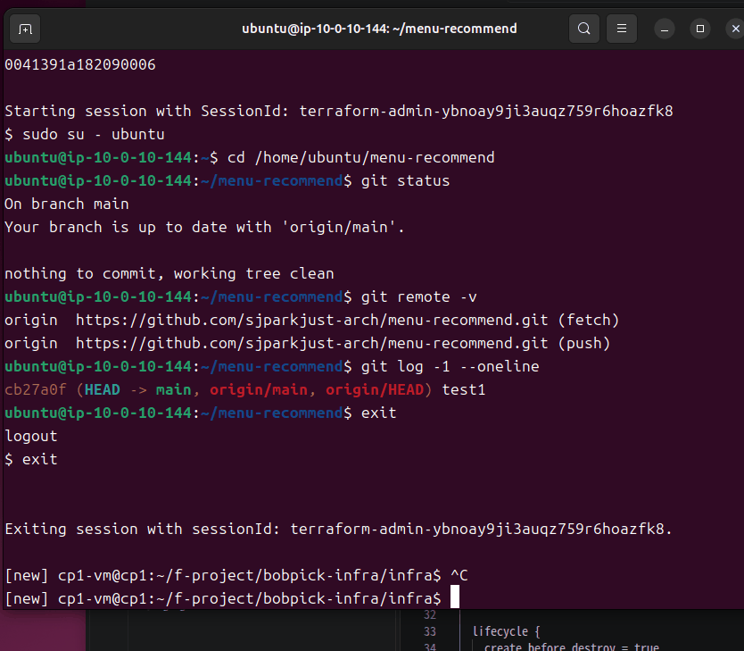

# 밥픽(BobPick) AWS 계정 이관

Terraform으로 구축된 Django 웹서비스 전체 스택을 다른 AWS 계정으로 옮긴 작업 기록입니다.

| | |
|---|---|
| 작업일 | 2026년 9월 14일 (약 3시간) |
| 출발 계정 | 304588611771 (팀원 계정) |
| 도착 계정 | 369904859006 (본인 계정) |
| 서비스 주소 | https://bobpick.cloud |

---

## 한눈에 보기

팀 프로젝트로 만든 서비스를 개인 계정으로 옮겨야 했습니다. 서버, 데이터베이스, 도메인, 배포 자동화까지 서비스를 이루는 모든 구성 요소를 새 계정에 다시 세우고, 주소가 그대로 동작하도록 만드는 작업입니다.

인프라가 코드(Terraform)로 관리되고 있었기 때문에 구성 자체는 재현할 수 있었습니다. 문제는 **코드로 재현되지 않는 것들**이었습니다. 서버 이미지, SSH 키, 도메인 소유권, 데이터베이스 안의 데이터는 계정에 묶여 있어 별도 절차가 필요했습니다.

| 항목 | 결과 |
|---|---|
| 재생성한 리소스 | 63개 (VPC, ALB, ASG, RDS, ElastiCache, CloudFront, WAF 등) |
| 서비스 중단 | 없음 (옛 계정은 이관 완료 확인 후 정리) |
| 데이터 | 옛 RDS가 이미 삭제되어 시드 명령으로 복구 (메뉴 193건, 회원 50명, 후기 291건) |
| DNS 전환 | 네임서버 변경 후 약 13분 만에 SSL 인증서 발급 완료 |
| CI/CD | 양쪽 저장소 Secrets 교체 후 파이프라인 정상 동작 확인 |

---

## 1. 배경

밥픽은 2인 팀 프로젝트로 개발한 메뉴 추천 서비스입니다. 취업 포트폴리오로 계속 운영하려면 팀원 계정에 있던 인프라를 개인 계정으로 옮겨야 했습니다.

이전에도 한 차례 계정 이관을 한 적이 있어(2026년 8월 28일) 대략의 절차는 알고 있었습니다. 그때 겪은 실패를 이번에 미리 차단하는 것이 이번 작업의 목표 중 하나였습니다.

**지난 이관에서 겪은 문제**

- SSH 키페어가 코드에는 이름만 있고 새 계정에 실체가 없어 Bastion 서버를 재생성해야 했음
- Instance Refresh를 중복 실행해 인스턴스가 5대까지 증가
- AMI 안에 옛 계정 엔드포인트가 박혀 있어 새 인스턴스가 DB에 접속하지 못함

---

## 2. 사전 분석 — 계정에 종속된 것 찾기

Terraform 코드를 전수 확인해 계정을 옮기면 깨지는 값을 먼저 식별했습니다.

| 파일 | 값 | 왜 바꿔야 하나 |
|---|---|---|
| `bootstrap/main.tf` | `bobpick-terraform-state-move0828` | S3 버킷명은 전 세계 유일해야 함 |
| `infra/main.tf` | backend bucket | 위와 반드시 일치해야 init 성공 |
| `infra/variables.tf` | `bobpick-main-s3-move0828` | 정적파일 버킷, 역시 유일해야 함 |
| `infra/asg.tf` | `image_id`, `key_name` | AMI와 키페어는 계정 소유 리소스 |
| `infra/ec2.tf` | `key_name` | 동일 |
| `infra/dns-tls.tf` | `aws_route53_zone` (resource) | 새 계정에 새 호스팅 영역 생성 → NS 전부 변경 |

`dns-tls.tf`가 호스팅 영역을 **데이터 소스가 아닌 리소스로 선언**하고 있다는 점이 중요했습니다. 계정이 바뀌면 네임서버 4개가 전부 새로 발급되고, 도메인 등록기관(가비아)에서 이를 다시 지정해야 SSL 인증서 검증이 통과합니다.

작업은 `migrate-369904` 브랜치에서 진행했습니다. `terraform.yml` 워크플로우가 main 브랜치 push 시 자동 apply를 실행하는데, GitHub Secrets가 아직 옛 계정 키인 상태에서 main에 올리면 **운영 중인 옛 계정에 새 코드가 적용되는 사고**가 나기 때문입니다.

---

## 3. 작업 순서

### 3.1 IAM 사용자 생성과 자격증명 분리

새 계정에 Terraform 전용 IAM 사용자를 만들었습니다. 콘솔 로그인 권한은 주지 않고 액세스 키만 발급해, CLI와 GitHub Actions에서만 쓰이도록 용도를 한정했습니다.


*콘솔 액세스 권한은 체크하지 않음 — 프로그래밍 방식 접근만 필요*


*AdministratorAccess 직접 연결*

옛 계정은 **콘솔에서만 작업**하기로 정하고 액세스 키를 발급하지 않았습니다. 로컬에는 새 계정 프로필만 등록해 계정을 잘못 짚는 사고를 구조적으로 막았습니다.

```bash
aws configure --profile new
echo 'export AWS_PROFILE=new' >> ~/.bashrc
```

터미널 프롬프트에 현재 프로필이 표시되도록 `PS1`도 수정했습니다. 두 계정을 오가는 작업에서 "지금 어느 계정인가"를 매번 확인하는 비용을 없애기 위해서입니다.

Terraform은 **1.9.0으로 고정 설치**했습니다. GitHub Actions의 `terraform.yml`이 같은 버전을 쓰기 때문에, 로컬에서 상위 버전으로 apply하면 state 파일에 그 버전이 기록되어 CI가 state를 읽지 못합니다.

### 3.2 AMI 계정 간 이전

AMI는 계정 소유 리소스라 그대로 넘어가지 않습니다. 두 단계로 처리했습니다.

**공유** — 옛 계정 콘솔에서 EC2 → AMI → 이미지 권한 편집으로 새 계정 ID를 추가했습니다. 이때 **"다음 스냅샷에 볼륨 생성 권한 추가"** 체크가 필수입니다. 이걸 빼면 AMI 목록에는 보이지만 복사가 실패합니다.

**복사** — 새 계정에서 "나와 공유됨" 필터로 찾아 `golden-ami-v3`로 복사했습니다.


*새 계정(369904859006)에서 공유받은 AMI를 자기 소유로 복사*

공유 상태로만 두면 안 되는 이유가 있습니다. 소유자는 여전히 옛 계정이라, 옛 계정을 정리하는 순간 AMI가 사라지고 ASG가 인스턴스를 띄우지 못합니다. **자기 소유 사본을 만들어야 독립이 완성됩니다.**

### 3.3 키페어 재생성

지난 이관에서 실패했던 지점입니다. 코드에는 `mysite-key-move`라는 이름만 있고 새 계정에 대응하는 개인키가 없어 Bastion을 재생성해야 했습니다.

이번에는 선제적으로 새 키페어를 만들고 코드를 함께 수정했습니다.

```bash
aws ec2 create-key-pair --key-name bobpick-key-0914 \
  --query 'KeyMaterial' --output text > ~/.ssh/bobpick-key-0914.pem
chmod 400 ~/.ssh/bobpick-key-0914.pem
```

### 3.4 코드 수정과 검증

계정 종속 값을 전수 교체한 뒤, 누락이 없는지 검색으로 확인했습니다.

```bash
grep -rn "move0828\|mysite-key-move\|ami-04e167" infra/ bootstrap/
```

결과가 비어 있어야 정상입니다. 눈으로 확인하는 대신 **검색으로 0건을 증명**하는 방식으로 진행했습니다.

### 3.5 부트스트랩 → 인프라 구축

순서가 고정되어 있습니다. `infra/main.tf`의 backend가 S3 버킷을 참조하는데, 그 버킷 자체를 만드는 것이 bootstrap이기 때문입니다. bootstrap에는 backend 블록이 없어 로컬 state로 동작합니다.

```
bootstrap (로컬 state) → S3 버킷 + DynamoDB 락 테이블 생성
         ↓
infra (S3 backend) → 실제 인프라 63개 생성
```

`terraform plan` 결과가 `63 to add, 0 to change, 0 to destroy`인 것을 확인하고 진행했습니다. **destroy가 0인지 확인하는 것**이 옛 계정 state를 잘못 물지 않았다는 증거입니다.

RDS 생성에 13분 46초가 걸린 뒤, ACM 인증서 검증 단계에서 apply가 멈췄습니다.


*aws_acm_certificate_validation에서 정지 — 도메인이 아직 옛 계정 네임서버를 보고 있음*

### 3.6 DNS 위임 이전

새 계정 Route 53에 생성된 네임서버 4개를 가비아에 등록했습니다.


*Route 53의 NS 레코드를 가비아 네임서버 설정에 그대로 입력*

여기서 혼동이 있었습니다. WHOIS에는 변경이 즉시 반영되는데 `dig`로 조회하면 계속 옛 값이 나왔습니다.


*등록기관 데이터베이스에는 즉시 반영 (Updated Date 04:27 UTC)*

둘이 보는 곳이 다르기 때문입니다.

- **WHOIS** — 등록기관이 관리하는 도메인 소유 정보 DB. 변경 즉시 반영
- **dig** — 실제 DNS 조회 경로. 캐시 서버(8.8.8.8 등)를 거치며, NS 레코드 TTL이 48시간이라 캐시가 만료돼야 재조회

즉 "서류상 등록"과 "실제 배송망"의 차이입니다. 이 구조를 이해하고 나니 `dig` 결과를 계속 확인할 이유가 없어졌습니다. ACM은 캐시 서버를 거치지 않고 권한 있는 네임서버에 직접 조회하기 때문에, 확인해야 할 지표는 인증서 상태 하나였습니다.

```bash
aws acm list-certificates --query 'CertificateSummaryList[*].[DomainName,Status]' --output text
```

네임서버 변경 약 13분 뒤 `ISSUED`로 전환되었고, 멈춰 있던 apply가 자동으로 재개되어 완료됐습니다.


*63개 리소스 생성 완료, 인증서 발급 확인*

### 3.7 데이터 복구 — 계획 변경

원래는 옛 RDS에서 `mysqldump`를 떠 새 RDS로 옮길 예정이었습니다. 그런데 작업 중 **옛 계정 RDS가 이미 삭제된 상태**임을 확인했습니다. 스냅샷도 없었습니다.

다행히 애플리케이션 저장소에 시드 명령이 코드로 구현되어 있었습니다.

```bash
python manage.py migrate
python manage.py seed_data    # 메뉴 193건, 알러지 연결 280건
python manage.py seed_demo    # 데모 사용자 10명, 좋아요 46 / 후기 20
python manage.py seed_dummy   # 더미 회원 40명, 좋아요 728 / 후기 271
```

최종적으로 유저 50명, 좋아요 774건, 후기 291건, 식사기록 1,194건이 채워졌습니다. 세 명령 모두 `get_or_create` 기반이라 재실행해도 중복이 생기지 않습니다.

실제 회원 계정과 후기는 유실됐지만, **인프라는 Terraform으로, 데이터는 시드 명령으로 복원 가능한 구조**였기에 작업을 계속할 수 있었습니다. 수동으로 구축한 환경이었다면 복구가 불가능했을 상황입니다.

### 3.8 애플리케이션 설정 교체

SSM Session Manager로 앱서버에 접속해 `.env`를 수정했습니다. 로컬에 플러그인이 없어 먼저 설치가 필요했습니다.

```bash
curl "https://s3.amazonaws.com/session-manager-downloads/plugin/latest/ubuntu_64bit/session-manager-plugin.deb" \
  -o session-manager-plugin.deb
sudo dpkg -i session-manager-plugin.deb
```

교체한 값은 네 개입니다.

```
DB_HOST=dev-mysql-db.ctisaa4ashqe.ap-northeast-2.rds.amazonaws.com
REDIS_URL=redis://dev-redis-cache.l9jfsc.0001.apn2.cache.amazonaws.com:6379/0
AWS_STORAGE_BUCKET_NAME=bobpick-main-s3-move0914
AWS_S3_CUSTOM_DOMAIN=d1gkjge9w9wt6v.cloudfront.net
```

**AWS 액세스 키 두 줄은 삭제했습니다.** EC2에 `bobpick-app-ec2-role`이 연결되어 있어 boto3가 인스턴스 메타데이터에서 임시 자격증명을 가져오기 때문입니다.

```bash
TOKEN=$(curl -sX PUT "http://169.254.169.254/latest/api/token" \
  -H "X-aws-ec2-metadata-token-ttl-seconds: 60")
curl -s -H "X-aws-ec2-metadata-token: $TOKEN" \
  http://169.254.169.254/latest/meta-data/iam/security-credentials/
# → bobpick-app-ec2-role
```

평문 키를 AMI에 구워 넣지 않게 되어 보안상으로도 개선입니다. `collectstatic`이 142개 파일을 정상 업로드하며 역할이 동작함을 확인했습니다.

첫 `migrate` 시도에서 `Access denied for user 'admin'` 오류가 발생했습니다. **타임아웃이 아닌 인증 거부**였으므로 네트워크는 정상이고 비밀번호 불일치임을 알 수 있었습니다. 에러 유형으로 원인 범위를 좁힌 사례입니다.

### 3.9 AMI 재생성과 무중단 교체

이 단계가 지난 이관의 핵심 실패 지점이었습니다. AMI 안의 `.env`가 옛 계정 엔드포인트를 가리키고 있어, 새로 뜨는 인스턴스마다 DB에 붙지 못하고 헬스체크에 실패했습니다.

ASG 활동 이력에 그 흔적이 남아 있습니다.

```
13:23  인스턴스 2대 최초 기동
13:30  교체 (terminate + launch)
13:36  교체
13:42  교체
```

`.env`를 수정한 상태를 AMI로 저장하고, `asg.tf`의 `image_id`를 교체한 뒤 Instance Refresh를 실행했습니다.


*교체 과정의 인스턴스 목록*

Instance Refresh는 **한 번만 실행하고 완료까지 대기**했습니다. 지난 이관에서 중복 실행으로 인스턴스가 5대까지 늘어난 전례가 있었기 때문입니다. `MinHealthyPercentage: 50`으로 2대 중 1대씩 교체하며, 타겟 그룹에서 신규 2대가 `healthy`, 구 2대가 `draining`으로 전환되는 것을 확인했습니다.

### 3.10 CI/CD 파이프라인 전환

양쪽 저장소의 Secrets를 새 계정 값으로 교체했습니다.

| 저장소 | 교체 항목 |
|---|---|
| bobpick-infra | AWS 키 2개, `TF_VAR_DB_PASSWORD` |
| menu-recommend | AWS 키 2개, `BASTION_HOST`, `BASTION_SG_ID`, `BASTION_KEY`, `CLOUDFRONT_DISTRIBUTION_ID` |

앱서버의 git 설정도 확인했습니다. user_data가 부팅 시 `git pull`을 실행하는 구조라, remote가 정상인지 검증이 필요했습니다.


*remote와 브랜치 정상, working tree clean*

첫 배포에서 실패가 발생했습니다.

```
===== Deploying to 10.0.2.107 =====
bash: line 1: cd: /home/***/menu-recommend: No such file or directory
```

`10.0.2.107`은 Bastion 서버였습니다. Django 앱이 없으니 당연히 실패합니다. ASG에서 인스턴스 IP를 조회하는 로직에 Bastion이 섞여 들어온 것이 원인이었습니다.

조회 방식을 **태그 기반**으로 변경해 해결했습니다.

```yaml
IPS=$(aws ec2 describe-instances \
  --filters "Name=tag:Name,Values=bobpick-app-server" \
            "Name=instance-state-name,Values=running" \
  --query 'Reservations[*].Instances[*].PrivateIpAddress' --output text)
```

Bastion은 태그가 `bobpick-public-bastion`이라 구조적으로 걸리지 않습니다. 필터로 제외하는 방식보다 **처음부터 대상만 선택하는 방식**이 안전합니다.

재실행 후 양쪽 워크플로우 모두 성공했습니다.

---

## 4. 문제와 해결 정리

| 문제 | 원인 | 해결 |
|---|---|---|
| AMI 복사 실패 | 스냅샷 권한 미부여 | 이미지 권한 편집 시 볼륨 생성 권한 함께 체크 |
| `dig`와 WHOIS 결과 불일치 | 캐시 DNS의 NS 레코드 TTL 48시간 | 확인 지표를 인증서 상태로 전환 |
| 옛 RDS 데이터 유실 | 이관 전 이미 삭제됨 | 앱 저장소의 시드 명령으로 재생성 |
| `migrate` 시 Access denied | `.env`와 RDS 비밀번호 불일치 | 에러 유형(타임아웃 아님)으로 원인 특정 후 값 일치 |
| CI/CD 배포가 Bastion에 시도 | ASG 조회에 Bastion IP 포함 | 인스턴스 태그 기반 조회로 변경 |
| `terraform apply` 시 RDS 비밀번호 의도치 않은 변경 | 프롬프트 입력값이 state와 불일치 | plan 단계에서 발견해 중단, 값 일치 후 재실행 |

마지막 항목은 특히 중요했습니다. plan 출력에 `~ password = (sensitive value)`가 섞여 있는 것을 발견하고 중단했는데, 그대로 진행했다면 RDS 비밀번호가 덮어써져 앱이 DB에 접속하지 못하는 상태가 됐을 것입니다. **plan 결과를 한 줄씩 확인하는 것이 실제로 장애를 막았습니다.**

---

## 5. 최종 구성

| 항목 | 값 |
|---|---|
| Bastion | 15.164.170.61 |
| RDS (MySQL) | dev-mysql-db.ctisaa4ashqe.ap-northeast-2.rds.amazonaws.com |
| ElastiCache (Redis) | dev-redis-cache.l9jfsc.0001.apn2.cache.amazonaws.com |
| CloudFront | d1gkjge9w9wt6v.cloudfront.net (E2Y1P2DZS1M92M) |
| S3 (정적파일) | bobpick-main-s3-move0914 |
| ASG | bobpick-app-asg-2026091404215840330000000a |
| AMI | ami-0bac0d3c217978bad |

네트워크는 2개 가용영역에 퍼블릭/프라이빗앱/프라이빗DB 서브넷 6개, NAT 게이트웨이 2개로 구성했습니다. ALB 앞단에 WAF(관리형 규칙 2종 + Rate Limit), 정적파일은 S3 + CloudFront(OAC)로 서빙합니다.

---

## 6. 회고

**IaC의 가치를 실측으로 확인했습니다.** 데이터베이스가 유실된 상황에서도 인프라는 코드로, 데이터는 시드 명령으로 복원할 수 있었습니다. 63개 리소스를 수동으로 재구축했다면 하루로는 어려웠을 작업입니다.

**계정 경계를 넘는 리소스의 특성을 다뤘습니다.** AMI 공유와 스냅샷 권한, Route 53 위임 이전과 DNS 캐시 전파, ACM 소유권 검증이 서로 맞물린 구조를 직접 해결했습니다. 각각은 문서에 나와 있지만, 세 가지가 순서대로 엮여 있다는 점은 실제로 해봐야 알 수 있는 부분이었습니다.

**지난 실패를 사전에 차단했습니다.** 키페어 누락과 Instance Refresh 중복 실행은 8월 이관에서 겪은 문제였고, 이번에는 작업 계획 단계에서 미리 처리했습니다. 같은 실수를 반복하지 않는 것이 두 번째 이관의 목표 중 하나였습니다.

**개선 여지도 확인했습니다.** `deploy.yml`이 모든 인스턴스에서 `migrate`와 `collectstatic`을 각각 실행하는데, DB와 S3는 공유 자원이라 한 번이면 충분합니다. 인스턴스가 늘어날수록 낭비가 커지는 구조라 개선이 필요합니다.
