# 밥픽(BobPick) 부하 테스트와 오토스케일링 검증

Apache JMeter로 서비스의 한계를 측정하고, 발견한 결함을 수정한 뒤 개선 효과를 재측정한 기록입니다.

| | |
|---|---|
| 작업일 | 2026년 9월 14일 ~ 15일 |
| 대상 | https://bobpick.cloud |
| 구성 | ALB + Auto Scaling Group (t3.micro, min 2 / max 4) + RDS MySQL + ElastiCache Redis |
| 도구 | Apache JMeter 5.6.3, CloudWatch, AWS CLI |

---

## 한눈에 보기

서버가 몇 명까지 감당하는지, 사람이 몰리면 서버가 자동으로 늘어나는지, 그 과정에서 사용자가 에러를 겪지는 않는지를 확인했습니다.

첫 테스트에서 **서버 증설 순간에 502 에러 40건**이 발생했습니다. 원인을 찾아 수정한 뒤 같은 조건으로 다시 측정하니 **0건**이 됐습니다.

| 지표 | 개선 전 (2차) | 개선 후 (3차) |
|---|---|---|
| 502 에러 | **40건 (1.91%)** | **0건** |
| 증설까지 걸린 시간 | 약 6분 | **4분 미만** |
| 증설 후 평균 응답 | 600ms | 595ms |
| 증설 후 처리량 | 87 TPS | 87 TPS |

성능 자체는 동일한데, **같은 결과를 에러 없이 달성**한 것이 개선의 내용입니다.

추가로 한계치와 축소 동작까지 측정해 오토스케일링 전 주기를 확인했습니다.

| 차수 | 조건 | 처리량 | 평균 응답 | Apdex | 에러율 |
|---|---|---|---|---|---|
| 1차 기준선 | 10명 / 2대 | 14.79 TPS | 93ms | — | 0% |
| 2차 증설 | 100명 / 2→4대 | 87 TPS | 600ms | 0.673 | 1.91% |
| 3차 개선 검증 | 100명 / 2→4대 | 87 TPS | 595ms | 0.673 | 0.00% |
| 4차 한계치 | 300명 / 4대 | 74 TPS | 3,495ms | 0.235 | 0.01% |
| 5차 축소 | 10명 / 4→2대 | 15.51 TPS | 92ms | **0.998** | 0.00% |

**결론: t3.micro 4대의 안전 운영 한계는 약 85 TPS, 동시 사용자 100명 수준입니다.**

---

## 1. 테스트 전 사전 점검

코드를 먼저 읽고 시작했습니다. 그대로 부하를 걸었다면 측정 자체가 무의미해질 문제가 두 가지 있었습니다.

### 1.1 오토스케일링 정책이 없었다

ASG는 `desired_capacity = 2`, `max_size = 4`로 설정되어 있었지만, **`aws_autoscaling_policy` 리소스가 없었습니다.** CloudWatch 알람은 SNS로 이메일만 보내고 스케일링을 트리거하지 않는 구조였습니다.

즉 CPU가 100%를 쳐도 인스턴스는 2대 그대로입니다. 오토스케일링 시연이 목적인데 애초에 동작할 수 없는 상태였습니다.

Target Tracking 정책을 추가했습니다.

```hcl
resource "aws_autoscaling_policy" "cpu_target" {
  name                      = "bobpick-cpu-target-tracking"
  autoscaling_group_name    = aws_autoscaling_group.app_asg.name
  policy_type               = "TargetTrackingScaling"
  estimated_instance_warmup = 180

  target_tracking_configuration {
    predefined_metric_specification {
      predefined_metric_type = "ASGAverageCPUUtilization"
    }
    target_value = 40.0
  }
}
```

목표 CPU를 40%로 잡은 것은 시연 목적입니다. 실서비스 기준이라면 60~70%가 적당합니다.

### 1.2 WAF가 부하 테스트를 차단한다

`waf.tf`의 Rate Limit 규칙이 걸려 있었습니다.

```hcl
rate_based_statement {
  limit              = 2000    # 5분간 2000회
  aggregate_key_type = "IP"
}
```

초당 약 6.7회입니다. JMeter로는 스레드 수십 개만 띄워도 넘기는 값이라, 그대로 두면 **서버 성능이 아니라 WAF 응답을 측정**하게 됩니다. 실제로 1차 기준선에서 14.79 TPS가 나왔으니, 화이트리스트가 없었다면 가장 가벼운 테스트에서도 차단됐을 것입니다.

테스트 IP를 priority 0 allow 규칙으로 예외 처리했습니다. Rate Limit(priority 3)보다 먼저 평가되고, allow로 매칭되면 이후 규칙을 건너뜁니다.

```hcl
rule {
  name     = "AllowLoadTestIP"
  priority = 0
  action { allow {} }
  statement {
    ip_set_reference_statement { arn = aws_wafv2_ip_set.loadtest.arn }
  }
  ...
}
```

이 규칙은 테스트 대상 IP에 한해 SQL Injection·XSS 검사까지 우회시키므로, **테스트 종료 후 제거**해야 합니다. 부하 테스트 전 rate limit을 진원지에 한해 완화하는 것은 표준 절차지만, 범위와 기간을 최소화하는 것이 전제입니다.

---

## 2. 테스트 시나리오 설계

JMeter 테스트 계획은 실제 사용자 동선을 따라 4개 요청으로 구성했습니다.

| 순서 | 경로 | 성격 |
|---|---|---|
| 01 | `/` | 메인 대시보드 — 협업 필터링 추천 로직 |
| 02 | `/menus/` | 메뉴 목록 — 페이지네이션 |
| 03 | `/menus/{1~193}/` | 메뉴 상세 — 랜덤 ID |
| 04 | `/menus/ranking/` | 랭킹 — 집계 쿼리 |

설정에서 두 가지를 의도적으로 넣었습니다.

**DNS 캐시 관리자** — JMeter는 기본적으로 DNS를 캐싱해 ALB 노드 하나에만 계속 접속합니다. ALB는 가용영역별로 노드 IP가 여러 개라, 이를 끄지 않으면 부하가 한쪽으로 쏠립니다.

```xml
<DNSCacheManager ...>
  <boolProp name="DNSCacheManager.clearEachIteration">true</boolProp>
</DNSCacheManager>
```

**파라미터화** — 스레드 수, ramp-up, 지속시간, think time을 `__P()` 함수로 외부 주입하도록 만들어 하나의 계획으로 5차까지 진행했습니다.

```bash
jmeter -n -t bobpick-loadtest.jmx \
  -Jthreads=100 -Jrampup=30 -Jduration=900 \
  -l scale3.jtl -e -o report-scale3/
```

측정은 전부 비GUI 모드(`-n`)로 진행했습니다. GUI로 부하를 걸면 JMeter 자체가 병목이 되어 측정값이 왜곡됩니다.

---

## 3. 1차 — 기준선 측정

**조건** 사용자 10명, 5분, 인스턴스 2대

부하 없는 상태의 성능을 기록하는 것이 목적입니다. 비교 대상이 없으면 이후 측정값이 좋은지 나쁜지 판단할 수 없습니다.

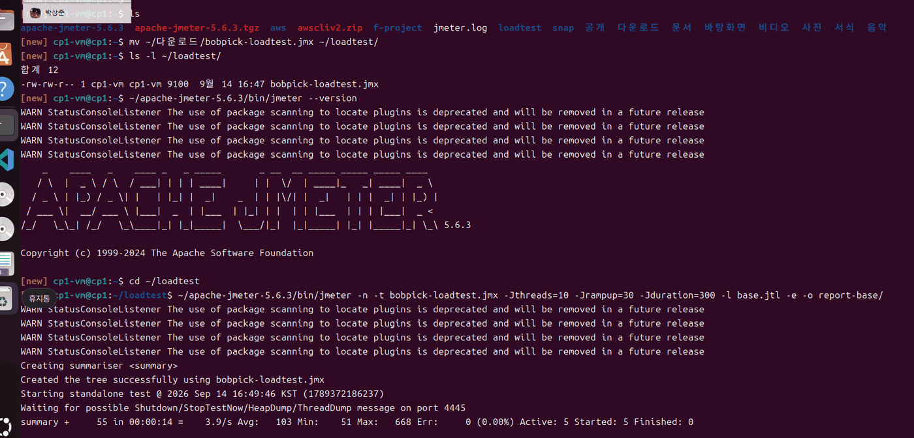

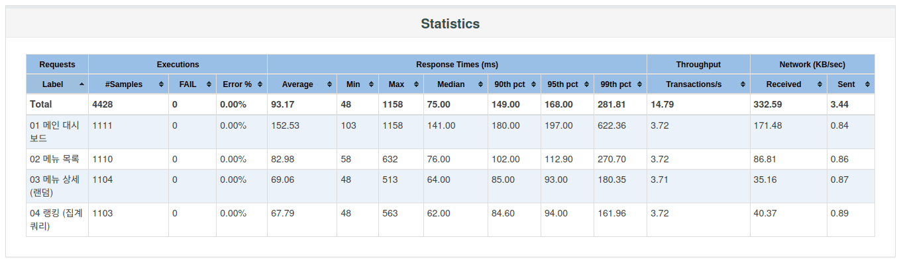

총 4,428건, 에러 0%, 평균 93.17ms, p90 149ms, 14.79 TPS.

**예상과 다른 결과가 나왔습니다.**

| 페이지 | 평균 | p90 | p99 |
|---|---|---|---|
| 01 메인 대시보드 | **152.53ms** | 180.00ms | 622.36ms |
| 02 메뉴 목록 | 82.98ms | 102.00ms | 270.70ms |
| 03 메뉴 상세 | 69.06ms | 85.00ms | 180.35ms |
| 04 랭킹 (집계) | 67.79ms | 84.60ms | 161.96ms |

집계 쿼리가 도는 랭킹이 가장 무거울 것으로 예상했으나 실제로는 가장 빨랐고, **메인 대시보드가 나머지의 2배**였습니다. 협업 필터링 추천이 매 요청마다 계산되는 것이 실제 비용이었습니다.

대시보드의 p99가 622ms로 p90(180ms)의 3.5배인 점도 눈에 띕니다. 평소엔 빠르지만 간헐적으로 튀는 요청이 있다는 뜻이고, 부하가 커지면 이 꼬리가 전체를 끌어내립니다.

---

## 4. 2차 — 오토스케일링 유발

**조건** 사용자 100명, 15분, ramp-up 120초

### 4.1 포화

응답시간이 빠르게 무너졌습니다.

| 경과 | 동시 사용자 | 평균 응답 | 최대 |
|---|---|---|---|
| 21초 | 18명 | 98ms | 529ms |
| 1분 21초 | 68명 | 679ms | 1,412ms |
| 2분 21초 | 100명 | 1,684ms | 15,026ms |
| 3분 21초 | 100명 | 1,766ms | 21,568ms |

기준선 93ms 대비 **19배 악화**입니다. CPU는 90.55%에 도달했습니다.

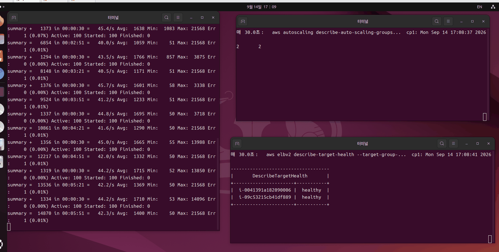
*응답시간 1,700ms대에서 고정, TPS 42~45에서 포화*

### 4.2 인스턴스가 늘어나지 않았다

CPU가 90%인데 인스턴스는 2대 그대로였습니다. 알람 상태를 확인하니 `OK`였습니다.

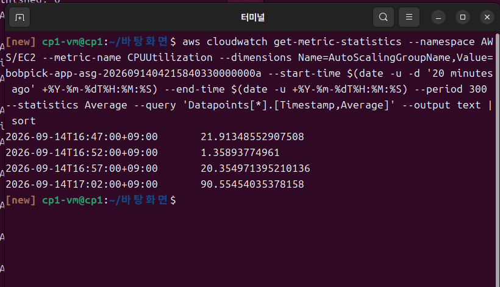
*CPU 90.55% — 그러나 AlarmHigh는 OK 상태 유지*

알람 설정을 직접 조회해 원인을 찾았습니다.

```bash
aws cloudwatch describe-alarms \
  --alarm-name-prefix TargetTracking-...-AlarmHigh \
  --query 'MetricAlarms[0].[Threshold,EvaluationPeriods,Period,StateReason]' --output text
```

```
40.0    3    60
Threshold Crossed: 1 datapoint [90.33125004111527 (14/09/26 08:05:00)]
was greater than the threshold (40.0).
```

원인이 명확했습니다.

- 알람 조건: **1분짜리 데이터 3개** 연속 40% 초과
- EC2 기본 모니터링: **5분 간격** 수집

1분 단위 데이터가 존재하지 않으니 3개를 채울 수 없습니다. StateReason이 "1 datapoint"라고 명시한 것이 결정적 증거였습니다. **정책은 올바르게 설정됐지만 메트릭 수집 주기와 알람 평가 주기가 어긋나 동작하지 않은 것**입니다.

상세 모니터링을 활성화하자 1분 만에 알람이 발동했습니다.

```bash
aws ec2 monitor-instances --instance-ids i-... i-...
```

### 4.3 증설과 회복

2대에서 4대로 증설된 뒤 성능이 회복됐습니다.

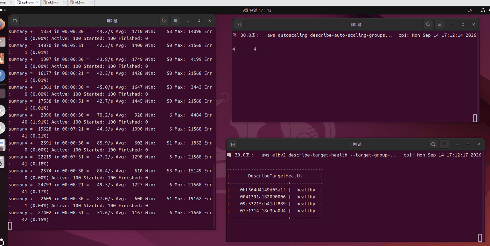
*4대 전부 healthy, 응답시간 1,647ms → 602ms*

| 경과 | 평균 응답 | TPS | 상태 |
|---|---|---|---|
| 6분 51초 | 1,647ms | 45.0 | 2대 |
| 7분 21초 | 928ms | 70.2 | 증설 진행 |
| 7분 51초 | 602ms | 85.9 | 4대 가동 |
| 8분 51초 | 600ms | 87.0 | 안정 |

**응답시간 2.7배 개선, 처리량 1.9배 증가.** 인스턴스가 2배로 늘자 처리량도 거의 정확히 2배가 됐습니다. 선형으로 확장된다는 뜻입니다.

### 4.4 그런데 502 에러 40건

증설 구간에서 에러가 집중 발생했습니다. 전체 42건 중 40건이 7분 21초 한 구간에 몰려 있었습니다.

```bash
awk -F',' 'NR>1 && $8=="false" {print $4}' scale.jtl | sort | uniq -c | sort -rn
```

```
     40 502
      2 Non HTTP response code: java.net.SocketException
```

502는 ALB가 백엔드에 연결은 했으나 정상적인 HTTP 응답을 받지 못했다는 뜻입니다. 원인은 `asg.tf`의 user_data에 있었습니다.

```bash
#!/bin/bash
cd /home/ubuntu/menu-recommend
git pull origin main
pip install -r requirements.txt
python manage.py migrate
python manage.py collectstatic --noinput
systemctl restart gunicorn      # ← 여기
```

발생 과정은 이렇습니다.

```
1. AMI 부팅 → gunicorn 자동 시작 (systemd enabled)
2. ALB 헬스체크 통과 → healthy 판정 → 트래픽 유입    ← 이미 요청 받음
3. user_data 실행 중 (git pull, pip install, migrate, collectstatic)
4. systemctl restart gunicorn → 리스닝 소켓 닫힘     ← 502 발생
5. gunicorn 재기동 완료 → 정상
```

**2번과 4번 사이에 들어온 요청이 전부 실패한 것**입니다. gunicorn이 AMI 부팅과 동시에 뜨니 헬스체크는 금방 통과하는데, 그 시점에 초기화 스크립트는 아직 돌고 있었습니다.

---

## 5. 개선 조치

네 가지를 적용했습니다.

### 5.1 gunicorn에 reload 지원 추가

`systemctl reload`를 쓰려면 서비스 파일에 `ExecReload`가 정의되어 있어야 합니다. 확인해보니 `ExecStart`만 있었습니다.

```ini
[Service]
User=ubuntu
ExecStart=/home/ubuntu/menu-recommend/venv/bin/gunicorn --workers 3 --bind 0.0.0.0:8000 config.wsgi:application
ExecReload=/bin/kill -s HUP $MAINPID     # 추가
KillMode=mixed                            # 추가
```

**restart와 reload의 차이**가 핵심입니다.

- `restart` — 마스터와 워커 3개를 모두 종료 후 재기동. 그 사이 8000번 포트를 듣는 프로세스가 없어 연결이 끊김
- `reload` — 마스터는 유지하고 워커만 순차 교체. 리스닝 소켓이 계속 열려 있어 요청이 끊기지 않음

이 파일은 Terraform이 아니라 **AMI 안에 있으므로**, 인스턴스에서 직접 수정한 뒤 AMI를 다시 구워야 합니다.

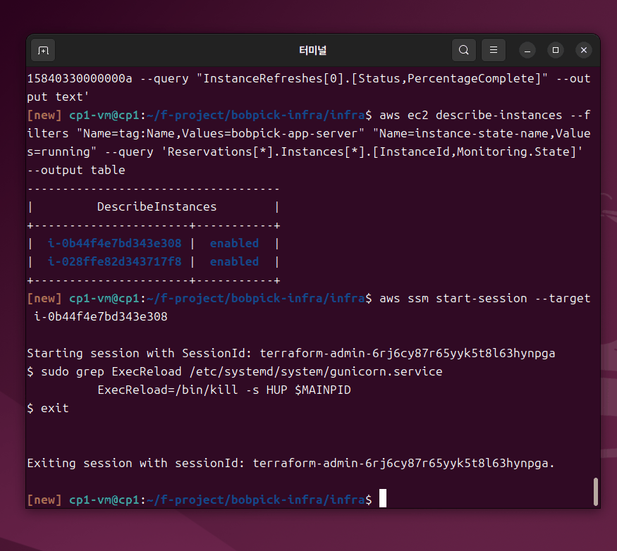
*새로 구운 AMI로 교체된 인스턴스에서 설정 확인*

### 5.2 user_data 정리

```hcl
user_data = base64encode(<<-EOF
  #!/bin/bash
  cd /home/ubuntu/menu-recommend
  sudo -u ubuntu git pull origin main
  sudo -u ubuntu venv/bin/pip install -r requirements.txt
  sudo systemctl reload gunicorn || sudo systemctl restart gunicorn
EOF
)
```

`migrate`와 `collectstatic`을 제거한 판단 기준은 **공유 자원이냐**입니다.

| 작업 | 대상 | 부팅 시 실행 | 이유 |
|---|---|---|---|
| `git pull` | 인스턴스 로컬 | 유지 | 코드 최신화는 인스턴스마다 필요 |
| `pip install` | 인스턴스 로컬 | 유지 | 패키지 누락 시 앱이 기동 불가 |
| `migrate` | RDS (공유) | 제거 | 동시 실행 시 마이그레이션 락 충돌 위험 |
| `collectstatic` | S3 (공유) | 제거 | 여러 인스턴스가 같은 파일을 중복 업로드 |

정적파일은 django-storages로 S3에 업로드되고 CloudFront에서 서빙되므로, 인스턴스마다 재업로드할 이유가 없습니다. 두 작업은 배포 파이프라인(`deploy.yml`)이 담당합니다.

### 5.3 타겟 그룹 slow_start

```hcl
resource "aws_lb_target_group" "app" {
  ...
  slow_start = 60
}
```

새 타겟에 60초에 걸쳐 트래픽을 점진적으로 늘립니다. 등록 직후 갑자기 25%의 부하를 떠안지 않게 됩니다.

### 5.4 상세 모니터링 코드화

2차에서 CLI로 임시 활성화했던 것을 launch template에 반영했습니다.

```hcl
monitoring {
  enabled = true
}
```

오토스케일링을 사용하면서 기본 모니터링(5분 간격)을 두면 알람 반응이 구조적으로 느려집니다.

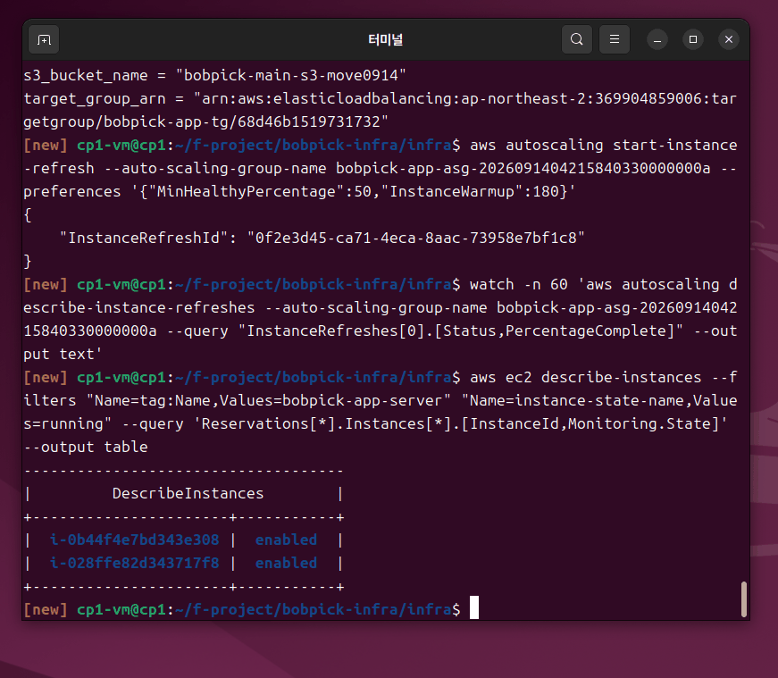
*새 인스턴스 2대 모두 enabled*

### 5.5 적용 과정 자체가 첫 검증

변경 사항을 적용하려면 Instance Refresh로 인스턴스를 교체해야 합니다. 이 과정에서 초당 1회 요청을 보내며 응답을 관찰했습니다.

```bash
while true; do curl -s -o /dev/null -w "%{http_code} " https://bobpick.cloud/; sleep 1; done
```

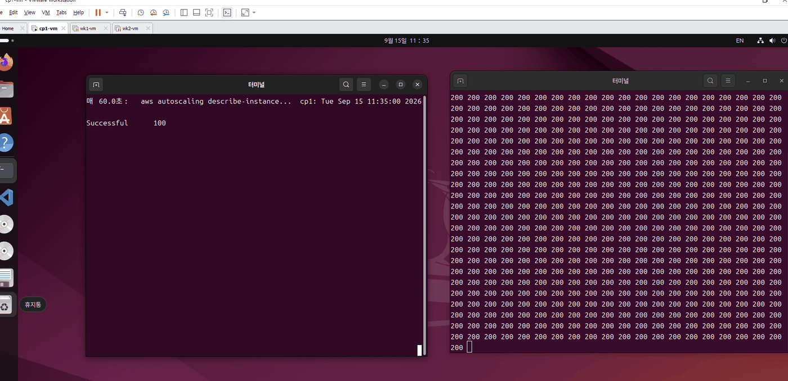
*인스턴스 2대를 전부 교체하는 10분 동안 200 응답만 기록*

502가 단 한 번도 섞이지 않았습니다.

---

## 6. 3차 — 개선 효과 검증

**조건** 2차와 동일 (사용자 100명, 15분). ramp-up만 30초로 단축

### 6.1 증설 시간 단축

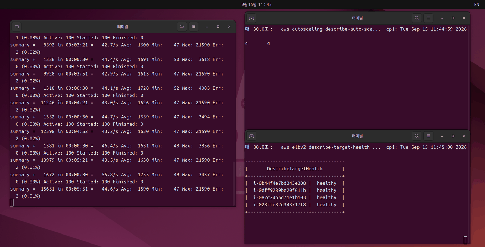
*4대 전부 healthy — 이 구간에서 에러 증가 없음*

AWS 활동 로그에 원인과 결과가 그대로 기록됐습니다.

```
11:43:19  AlarmHigh in state ALARM triggered policy bobpick-cpu-target-tracking
          changing the desired capacity from 2 to 4.
11:43:31  인스턴스 2대 동시 기동
```

11:39:08 시작이니 **4분 미만**입니다. 2차의 약 6분(그것도 모니터링을 수동으로 켠 뒤)과 비교됩니다.

증설이 `2 to 4`로 한 번에 이뤄진 점도 확인할 수 있습니다. Target Tracking은 목표값(CPU 40%)을 맞추는 데 필요한 용량을 계산해 한 번에 반영하며, 한 대씩 순차 증설하지 않습니다.

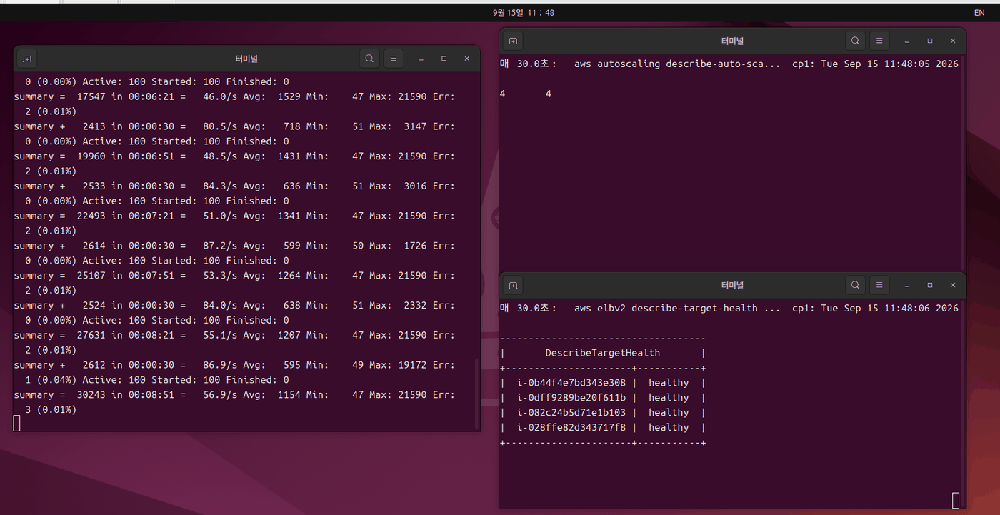
*응답시간 595ms, TPS 87 — 2차와 동일한 수준으로 회복*

### 6.2 502 에러 0건

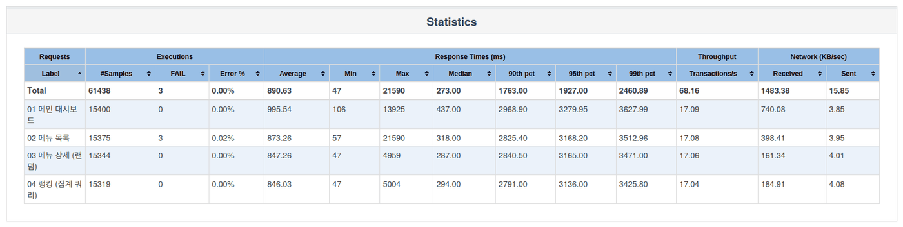

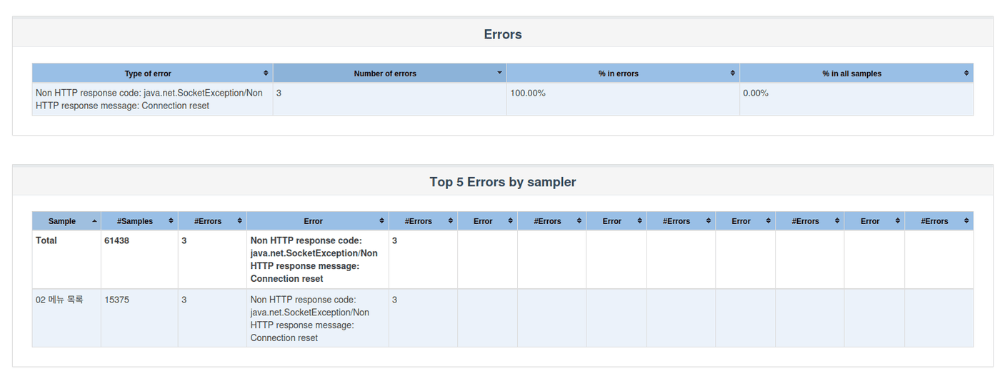
*총 61,438건 중 에러 3건, 502는 0건*

총 61,438건, 에러율 0.00%. 남은 3건은 전부 `Connection reset`이었습니다.

발생 시각과 응답시간을 함께 확인했습니다.

```bash
awk -F',' 'NR>1 && $8=="false" {print $1, $2, $4}' scale3.jtl
```

```
1789440059870  21573  Non HTTP response code: java.net.SocketException
1789440108806  21590  Non HTTP response code: java.net.SocketException
1789440446716  19172  Non HTTP response code: java.net.SocketException
```

**elapsed가 21초, 21초, 19초입니다.** 즉시 거절이 아니라 JMeter의 응답 타임아웃(20초)을 초과한 건들이었습니다. 서버가 연결을 끊은 것이 아니라 클라이언트가 기다리다 포기한 것입니다.

시각을 보면 2건은 증설 전 2대 포화 구간(11:40:59, 11:41:48), 1건은 4대 안정화 후 꼬리 지연(11:47:26)이었습니다. **502가 나던 증설 구간(11:43~11:45)에는 에러가 하나도 없었습니다.**

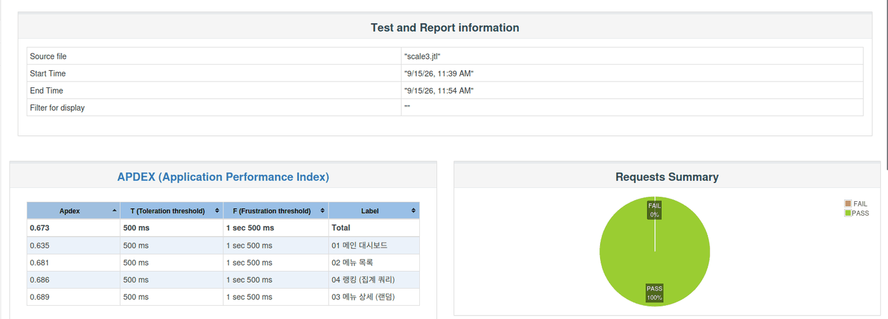
*Apdex 0.673 (기준 500ms)*

### 6.3 개선 전후 비교

| 항목 | 2차 (개선 전) | 3차 (개선 후) |
|---|---|---|
| 총 요청 | 약 30,000건 | 61,438건 |
| 502 에러 | 40건 | **0건** |
| 기타 에러 | 2건 | 3건 (타임아웃) |
| 증설 소요 | 약 6분 | 4분 미만 |
| 증설 후 평균 | 600ms | 595ms |
| 증설 후 TPS | 87 | 87 |

성능은 동일하고 에러만 사라졌습니다. 개선의 내용이 정확히 그것이었습니다.

---

## 7. 서버 측 지표로 교차 확인

JMeter는 클라이언트에서 잰 값입니다. 같은 시간대를 AWS가 서버 측에서 기록한 지표와 대조하면 측정의 신뢰도를 확인할 수 있습니다.

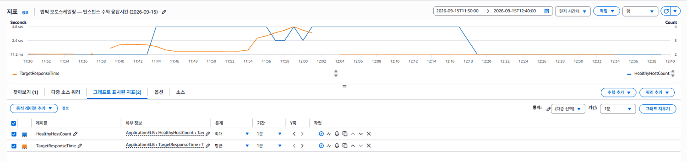
*파란 선은 정상 인스턴스 수(오른쪽 축), 주황 선은 ALB가 측정한 평균 응답시간(왼쪽 축). 1분 간격*

이 한 장에 오토스케일링 전 주기가 담겨 있습니다.

| 시각 | 그래프에서 읽히는 것 |
|---|---|
| 11:38~11:44 | 응답시간 상승, 인스턴스 2대 유지 |
| 11:44 | 파란 선 수직 상승 (2 → 4), 직후 주황 선 급락 |
| 11:54~12:02 | 300명 부하로 응답시간 재상승 |
| 11:58 | 파란 선의 계곡 — 인스턴스가 unhealthy로 빠지고 교체된 순간 |
| 12:18~12:19 | 파란 선 하강, **4 → 3 → 2 단계적 축소** |

축소 구간이 두 계단으로 나뉘어 보이는 것이 증설과의 차이를 그대로 드러냅니다. 증설은 `2 → 4`로 한 번에 수직 상승하지만, 축소는 한 대씩 내려옵니다. 기간을 1분으로 설정했기에 이 차이가 그래프에 잡혔습니다.

11:58의 계곡은 4차 한계치 테스트에서 헬스체크 실패로 인스턴스가 퇴출된 시점이며, ASG 활동 로그의 기록과 정확히 대응합니다.

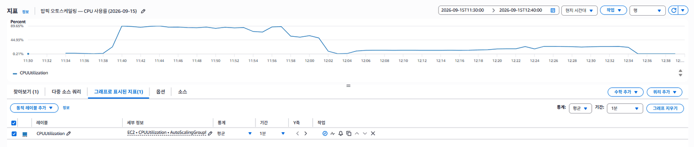
*Auto Scaling 그룹 평균 CPU 사용률, 1분 간격*

CPU 곡선에서 두 가지를 확인할 수 있습니다.

**증설 후에도 목표치에 도달하지 못했습니다.** 11:44에 4대로 늘었는데 CPU는 11:57까지 85~90%를 유지합니다. Target Tracking의 목표값은 40%였으므로 정책 관점에서는 계속 증설을 원하는 상태였지만, `max_size = 4`에 막혀 더 늘릴 수 없었습니다. **max_size가 실질적 병목이라는 직접 증거**입니다.

**한계치 구간에서 CPU가 오히려 내려갔습니다.** 11:57 이후 부하를 300명으로 올렸는데 CPU는 70%대로 떨어집니다. 부하가 줄어서가 아니라, t3.micro가 버스터블 인스턴스라 CPU 크레딧을 소진하면서 스로틀링이 걸린 것입니다. **쓰고 싶어도 쓸 수 없는 상태**이며, 같은 구간에서 처리량이 83에서 74 TPS로 역행한 것과 같은 원인입니다.

JMeter 측정치와 CloudWatch 지표가 같은 시점에 같은 방향으로 움직인다는 점에서, 클라이언트 측 측정이 실제 서버 상태를 정확히 반영했음을 확인했습니다.

---

## 8. 4차 — 한계치 측정

**조건** 사용자 300명, think time 0, 4대 유지 상태에서 시작

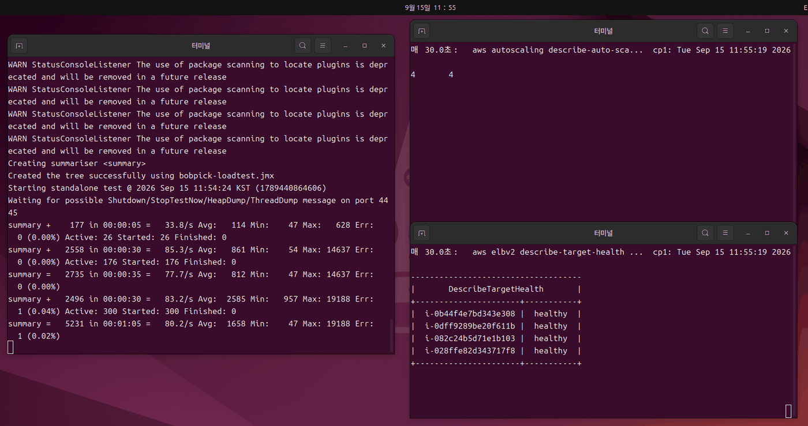

### 8.1 처리량이 역행했다

| 조건 | TPS | 평균 응답 |
|---|---|---|
| 100명 / 4대 | 87 | 600ms |
| 300명 / 4대 | 83 → **74** | 3,495ms |

**사용자를 3배로 늘렸는데 처리량이 오히려 15% 감소했습니다.** 이것이 포화의 정확한 정의입니다. 사용자가 늘어도 처리량은 늘지 않고 대기시간만 길어집니다.

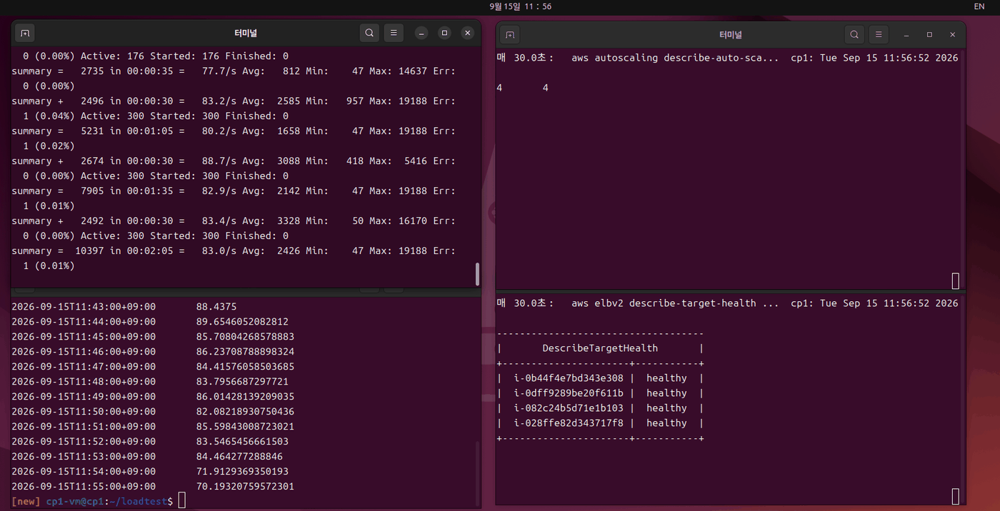
*TPS 83에서 고정, CPU는 크레딧 소진으로 70%대로 하락*

CPU가 오히려 내려간 점이 흥미롭습니다. t3.micro는 버스터블 인스턴스라 CPU 크레딧을 소진하면 스로틀링이 걸립니다. **CPU를 더 쓰고 싶어도 쓸 수 없는 상태**입니다.

### 8.2 페이지별 차이가 사라졌다

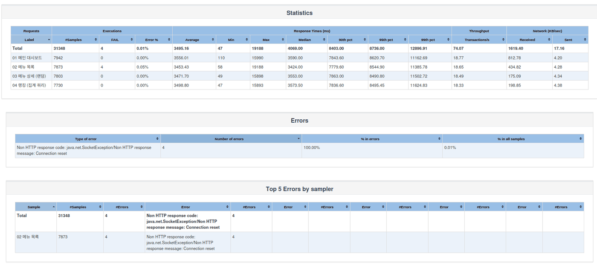

| 페이지 | 평균 | p90 | p99 |
|---|---|---|---|
| 01 메인 대시보드 | 3,556.01ms | 7,843.60ms | 11,162.69ms |
| 02 메뉴 목록 | 3,453.43ms | 7,779.60ms | 11,385.78ms |
| 03 메뉴 상세 | 3,471.70ms | 7,863.00ms | 11,502.72ms |
| 04 랭킹 | 3,498.80ms | 7,836.60ms | 11,624.83ms |

**네 페이지가 전부 3.5초로 평준화됐습니다.** 기준선에서 대시보드(152ms)와 랭킹(68ms)이 2배 넘게 차이났던 것과 대조적입니다.

페이지별 처리 비용 차이가 무의미해졌다는 것은, **병목이 애플리케이션 로직이 아니라 그 앞단의 대기열**이라는 뜻입니다. gunicorn 워커 3개가 전부 점유된 상태에서 요청들이 큐에서 기다리는 시간이 전체를 지배합니다. 어떤 페이지를 요청하든 줄 서는 시간은 같기 때문입니다.

p99가 11초를 넘는 것도 같은 이유입니다. 큐 맨 뒤에 선 요청이 그만큼 기다린 것입니다.

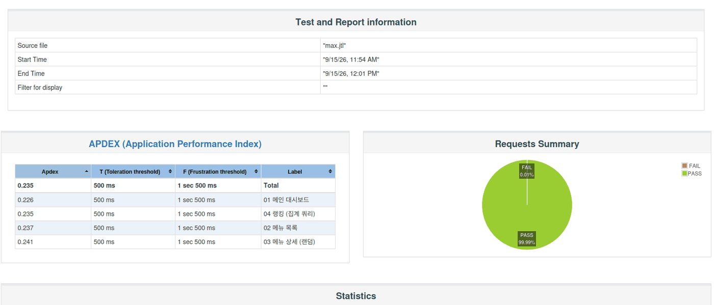
*Apdex 0.235 — 수용 불가(0.5 미만) 구간*

### 8.3 인스턴스가 죽었다

6분 36초 지점에 인스턴스 하나가 unhealthy 판정을 받고 퇴출됐습니다.

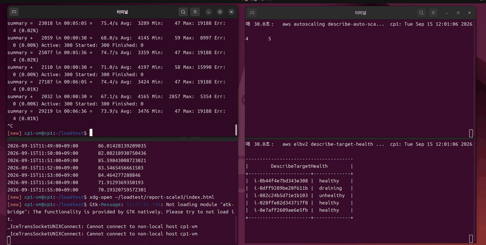
*draining과 unhealthy 상태, ASG가 교체분 투입 (일시적으로 5대)*

```
11:58:14  Terminating EC2 instance: i-0dff9289be20f611b
          At ...Z an instance was taken out of service in response to
          an ELB system health check failure.
11:58:16  Launching a new EC2 instance: i-0e7aff2609ae6e5fb
          At ...Z an instance was launched in response to
          an unhealthy instance needing to be replaced.
```

응답시간이 3.4초를 넘기면서 헬스체크 요청(`GET /`, 타임아웃 5초)도 실패했고, `unhealthy_threshold = 3`에 따라 3회 연속 실패로 퇴출된 것입니다.

**단순한 성능 저하가 아니라 과부하가 인스턴스 퇴출을 유발하고, 남은 인스턴스에 부하가 몰려 상황이 악화되는 연쇄 구조**를 실제로 관찰했습니다.

`max_size = 4`라 5대째는 뜨지 않았습니다. 3차에서도 4대 증설 후 CPU가 85%를 유지했는데, 목표값 40%에 도달하려면 이론적으로 8대가 필요했다는 뜻입니다. **max_size 4가 실질적 병목**임이 두 차례 측정으로 확인됐습니다.

---

## 9. 5차 — 축소 동작 관찰

**조건** 사용자 10명, 30분

2차에서는 부하를 완전히 끊은 뒤 축소가 일어나 측정 구간 밖이었습니다. 이번에는 **가벼운 부하를 유지한 채로** 30분을 돌려 축소 순간을 구간 안에 담았습니다. 사용자 10명이면 CPU가 5% 수준이라 축소 조건은 충족됩니다.

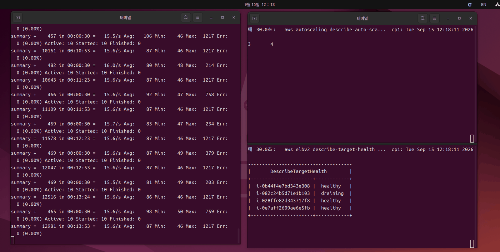
*DesiredCapacity 4 → 3, 한 대가 draining 상태로 전환 — 한 번에 2로 내려가지 않는다*

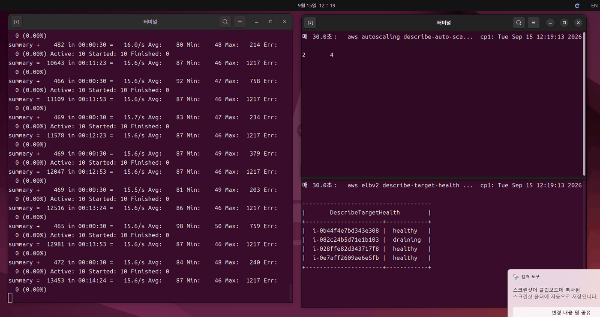
*DesiredCapacity 3 → 2, min_size에 도달해 정지*

```
12:17:56  AlarmLow ... changing the desired capacity from 4 to 3.
12:19:09  AlarmLow ... changing the desired capacity from 3 to 2.
```

12:04 시작이니 **14분 만에** 축소가 시작됐습니다.

### 증설과 축소는 비대칭이다

같은 정책인데 방향에 따라 다르게 동작합니다.

| | 증설 | 축소 |
|---|---|---|
| 방식 | `2 → 4` 한 번에 | `4 → 3 → 2` 단계적 |
| 소요 | 4분 미만 | 14분 |

트래픽이 잠깐 줄었다고 성급히 서버를 내리면, 다시 늘 때 증설 지연으로 장애가 납니다. **증설은 빠르고 축소는 느린 설계**가 의도된 것이며, 이를 실측으로 확인했습니다.

### 축소 중에도 사용자 영향 없음

30분간 총 27,912건, 에러 1건, 평균 91.86ms, p90 148ms, **Apdex 0.998**.

기준선과 거의 동일한 수치입니다.

| 지표 | 1차 기준선 (2대) | 5차 축소 (4→2대) |
|---|---|---|
| 평균 | 93.17ms | 91.86ms |
| p90 | 149ms | 148ms |
| 에러 | 0% | 0.00% |

**서버를 절반으로 줄이는 과정에서 응답시간이 전혀 나빠지지 않았습니다.** draining이 기존 연결을 정상 종료시키고, 남은 2대가 사용자 10명은 여유롭게 감당하기 때문입니다.

페이지별 순위도 기준선과 동일하게 돌아왔습니다. 대시보드 150.43ms로 가장 느리고 랭킹 65.83ms로 가장 빠릅니다. 4차에서 전부 3.5초로 평준화됐던 것과 대비되며, **부하가 없으면 페이지별 고유 비용이 다시 드러난다**는 점을 보여줍니다.

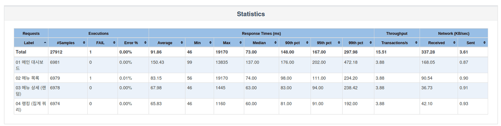
*27,912건, 평균 91.86ms, p90 148ms — 1차 기준선과 사실상 동일*

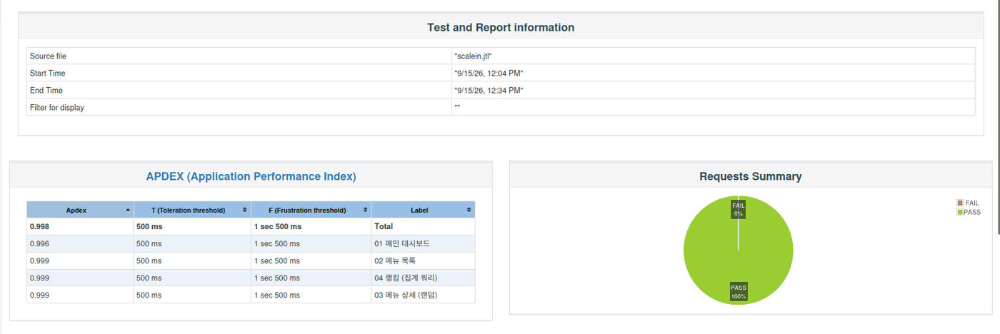
*Apdex 0.998 — 전 측정 중 최고치. 페이지별로도 0.996~0.999*

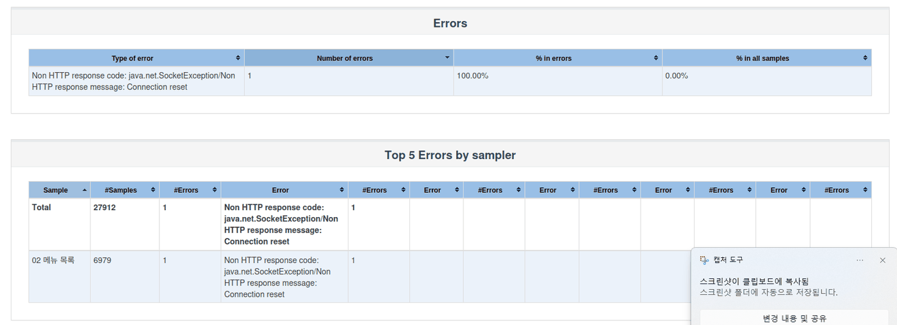
*에러 1건(Connection reset), 전체 대비 0.00%*

---

## 10. 오토스케일링 전 주기 기록

ASG 활동 이력에 증설·장애·축소가 모두 남았습니다. AWS가 직접 기록한 인과관계입니다.

```
12:19:19  Terminating i-0b44f4e7bd343e308
          AlarmLow triggered policy ... changing the desired capacity from 3 to 2.

12:18:02  Terminating i-082c24b5d71e1b103
          AlarmLow triggered policy ... changing the desired capacity from 4 to 3.

11:58:16  Launching i-0e7aff2609ae6e5fb
          launched in response to an unhealthy instance needing to be replaced.

11:58:14  Terminating i-0dff9289be20f611b
          taken out of service in response to an ELB system health check failure.

11:43:31  Launching i-082c24b5d71e1b103
11:43:31  Launching i-0dff9289be20f611b
          AlarmHigh triggered policy ... changing the desired capacity from 2 to 4.

11:28:21  Launching i-028ffe82d343717f8
          launched in response to an instance refresh.
```

세 종류의 인스턴스 교체가 한 표에서 구분됩니다.

- `in response to an instance refresh` — 의도된 배포
- `in response to an ELB system health check failure` — 장애
- `in response to a difference between desired and actual capacity` — 정책 기반 조정

---

## 11. 결론과 남은 과제

### 확인한 것

**안전 운영 한계는 약 85 TPS, 동시 사용자 100명 수준입니다.** 그 이상에서는 처리량이 역행하고 인스턴스 퇴출이 시작됩니다.

**502 에러 40건을 0건으로 만들었습니다.** JTL 로그 분석으로 원인(user_data의 `systemctl restart`)을 특정하고, gunicorn `reload` 전환과 `slow_start` 적용으로 해결한 뒤 재측정으로 검증했습니다.

**오토스케일링이 동작하지 않는 두 가지 원인을 찾았습니다.** 정책 자체가 없었던 것, 그리고 정책을 추가한 뒤에도 메트릭 수집 주기(5분)와 알람 평가 주기(1분)가 어긋나 발동하지 않았던 것입니다. 후자는 "설정은 맞는데 왜 안 늘어나지?"의 흔한 원인이며, `StateReason` 필드에서 근거를 찾아 진단했습니다.

### 남은 과제

**메인 대시보드 추천 로직 최적화** — 모든 측정 조건에서 가장 느렸습니다. 협업 필터링 결과를 Redis에 캐싱하면 개선 여지가 큽니다.

**max_size 상향 또는 인스턴스 타입 변경** — 4대로도 CPU 85%를 유지했습니다. t3.micro는 버스터블이라 지속적인 고부하에 부적합하며, 크레딧 소진 시 성능이 급락합니다.

**gunicorn 워커 수 조정** — 워커 3개가 병목이었습니다. `(2 × CPU 코어) + 1` 기준이면 t3.micro(2 vCPU)에서 5개가 적정입니다.

**deploy.yml의 중복 실행 제거** — 배포 시 모든 인스턴스에서 `migrate`와 `collectstatic`이 각각 실행됩니다. 공유 자원이라 한 번이면 충분하며, 인스턴스가 늘어날수록 낭비가 커집니다.

**헬스체크 엔드포인트 분리** — 현재 `GET /`를 헬스체크에 사용합니다. 추천 로직이 도는 무거운 페이지라 부하 시 헬스체크가 먼저 실패합니다. DB 연결만 확인하는 가벼운 전용 엔드포인트를 두면 4차에서 관찰한 연쇄 퇴출을 줄일 수 있습니다.

---

## 부록 — 테스트 환경

| 항목 | 값 |
|---|---|
| 애플리케이션 | Django 6.0.7, gunicorn 26.0.0 (워커 3) |
| 인스턴스 | t3.micro × 2~4 (ap-northeast-2a, 2c) |
| 데이터베이스 | RDS MySQL (프라이빗 서브넷) |
| 캐시 | ElastiCache Redis |
| 부하 발생 | JMeter 5.6.3, 비GUI 모드, 단일 노드 |
| 측정 데이터 | JTL 원본 + HTML 리포트 5세트 |
